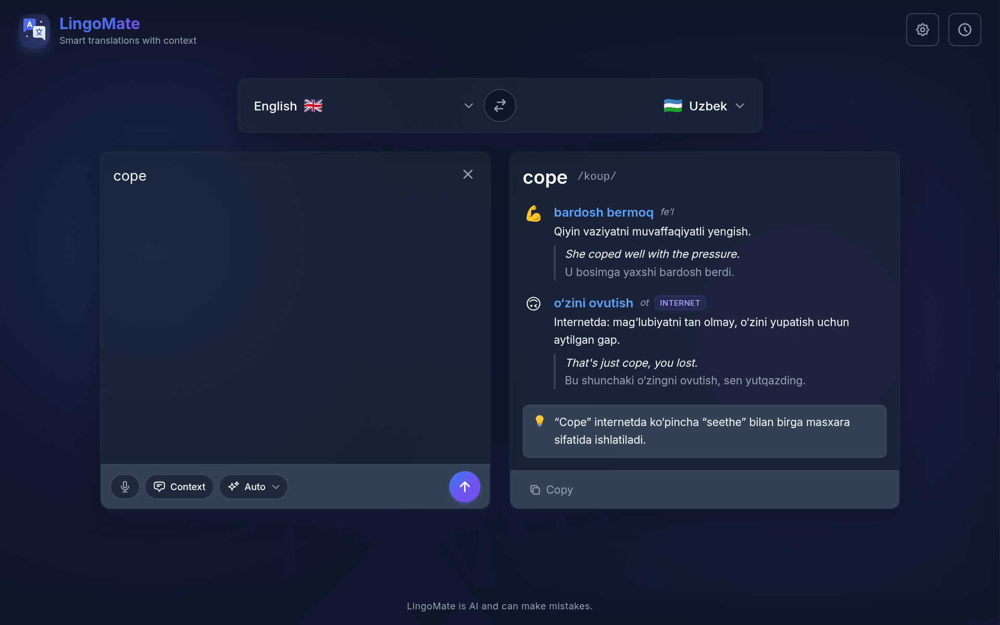

# 🌐 LingoMate

> **More than just words.** A smart, context-aware translator that understands nuance, slang, and multiple meanings.

> **LIVE ON** [lingomate-translate.vercel.app](https://lingomate-translate.vercel.app/)


## ✨ Features



### 🧠 Translation Modes
Pick a mode right next to the input (or leave it on **Auto**):
*   **✨ Auto**: Dictionary for up to 5 words, Translate for anything longer.
*   **📚 Dictionary**: For words and short phrases. Pronunciation, every common meaning with its part of speech, a usage note and an example sentence with translation. Genuine slang, Gen Z and internet meanings (e.g. "cope", "mid") are included and tagged, but only when the word really has them.
*   **🌐 Translate**: Natural, native-sounding translation of sentences and longer text, streamed in as it's generated.
*   **🔍 Find a word**: Forgot a word? Describe it ("a place where you borrow books") and get the best matching words in your target language.

### ⚡ Fast, Streaming AI Engine
Powered by Google's low-latency **Gemini Flash-Lite** models. Translations stream in word by word as they're generated.
*   **Gemini 3.5 Flash-Lite** (default) and **Gemini 3.1 Flash-Lite**, selectable in Settings for all modes.
*   **Automatic fallback**: if the chosen model fails, is rate-limited or is slow to respond, the other one takes over, you get a notification, and LumenAI sticks with the fallback for 15 minutes before trying the main model again.

### 🎧 Audio & Voice Features
*   **Speech-to-Text (STT)**: Speak directly into the app using native browser speech recognition.
*   **Smart Text-to-Speech (TTS)**:
    *   **Native Accent Force**: Automatically detects and forces the *correct* regional voice (e.g., French voice for French text) to ensure perfect pronunciation.
    *   **Intelligent Reading**: In Dictionary and Find a word modes, only the translated words are read aloud.
    *   **Voice Quality**: Prioritizes high-quality Google/Microsoft neural voices if available on your device.

### 🎯 Precision Logic
*   **Auto-Detect Mastery**: Automatically identifies the input language and adapts its translation rules perfectly.
*   **Strict Language Enforcement**: Prevents "false friend" errors. If you explicitly select **German** but type "Gift" (which exists in English too), it forces the AI to treat it as German ("Poison") instead of guessing English ("Present").
*   **🎭 Context Button**: Add optional context notes (e.g., "formal email", "Gen Z slang", "medical document") to get the exact tone you need.

### 🚀 Key Capabilities
*   **🎨 Beautiful Glassmorphic UI**: Minimalist, elevated UI components with smooth animations and dark mode support that looks gorgeous on any device.
*   **📱 Installable App (PWA)**: Add to your mobile home screen and use it like a native iOS or Android app.
*   **💾 Local History**: Automatically saves your translations locally so you never lose your vocabulary lists.

## 🛠️ Getting Started

### Prerequisites
*   Node.js 18+
*   npm or yarn
*   A [Gemini API key](https://aistudio.google.com/app/apikey)

### Installation

1.  **Clone the repository**
    ```bash
    git clone https://github.com/doniyor117/lumenai_translate.git
    cd lumenai_translate
    ```

2.  **Install dependencies**
    ```bash
    npm install
    ```

3.  **Configure Environment**
    Create a `.env.local` file in the root directory:
    ```env
    GEMINI_API_KEY=your_gemini_key_here
    ```

4.  **Run the development server**
    ```bash
    npm run dev
    ```

    Open [http://localhost:3000](http://localhost:3000) with your browser.

## 📱 How to Install on Mobile

This app is a fully functional Progressive Web App (PWA).

*   **iOS**: Open in Safari → Tap 'Share' → Select 'Add to Home Screen'.
*   **Android**: Open in Chrome → Tap menu (⋮) → Select 'Install app'.

## 🤝 Contributing

Contributions are welcome! Please feel free to submit a Pull Request.

## 📄 License

This project is licensed under the MIT License - see the LICENSE file for details.
